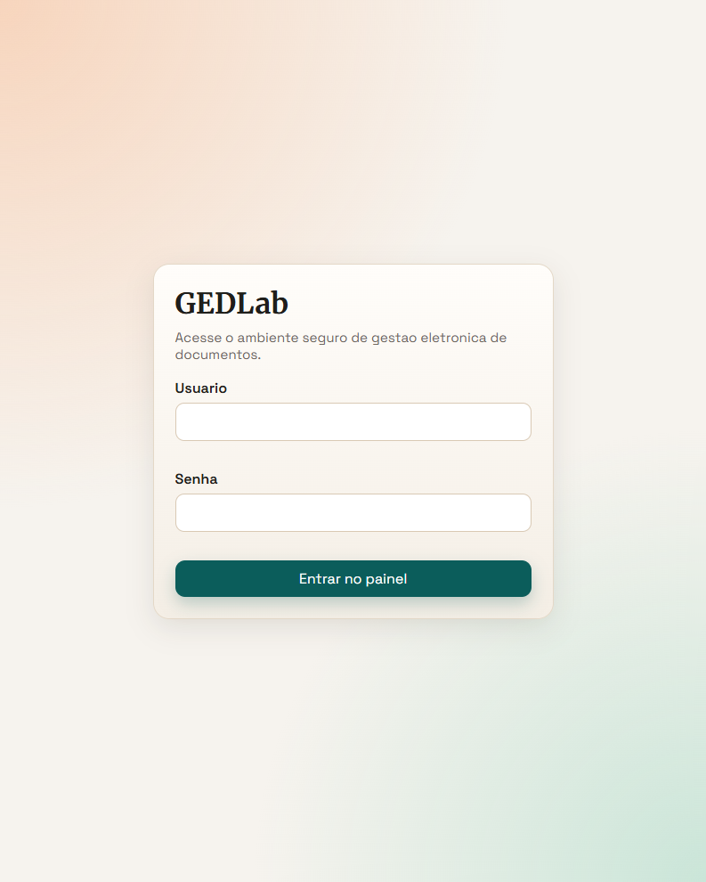
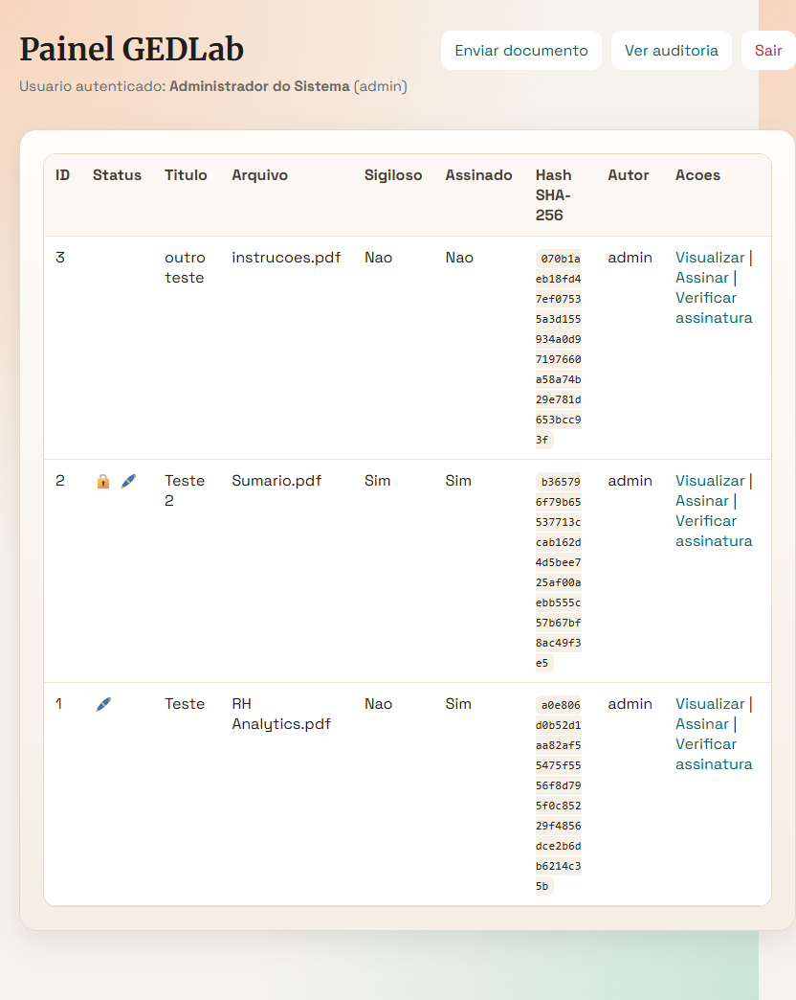
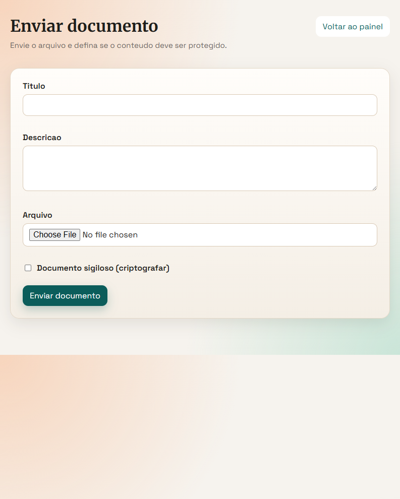
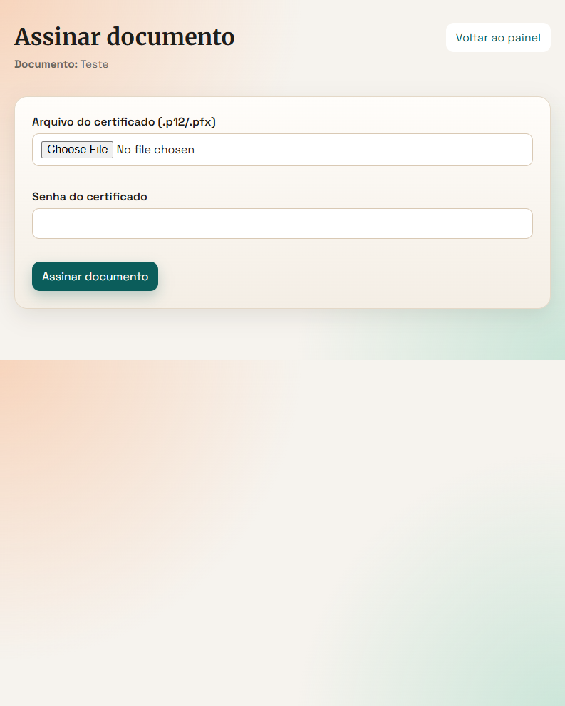
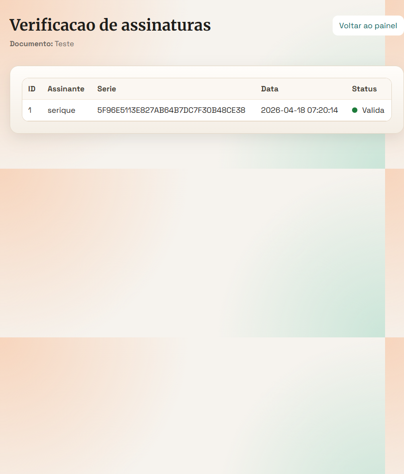
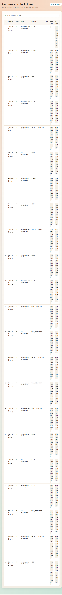

# Documentacao Complementar

Este diretorio concentra materiais de apoio do projeto GEDLab, como capturas de tela e artefatos visuais para apresentacao tecnica e academica.

## Screenshots de Areas Relevantes

### 1. Login

### 2. Painel Principal

### 3. Upload de Documento

### 4. Assinatura Digital

### 5. Verificacao de Assinaturas

### 6. Auditoria

